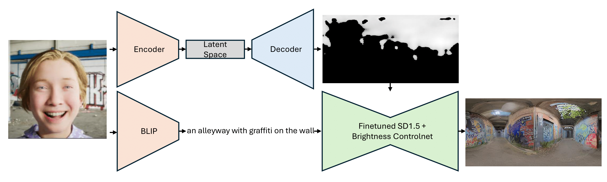
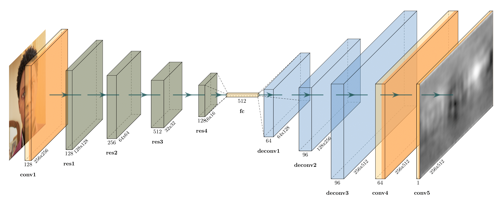

# FaceLightSource: Deep Learning-based Light Source Estimation from Face Images

### [Thesis link soon]



>**Abstract:** Abstract will be added
[Philipp Hochhauser](https://www.linkedin.com/in/phochhauser/)


## 0. Update

## 1. Installation
Install requirements from requirements.txt

Setup configuration file in config.json

## 2. Training the brightness estimation models
At this moment we are not able to provide the full dataset. A small subset of the test dataset well be provided soon.

### Custom Dataset
The dataset should be structured as follows:
```
metadata.csv
data/
    - name1_0.png
    - name1_1.png
    - ...
    - name2_0.png
    - ...
labels/
    - name1_0.hdr
    - name1_1.hdr
    - ...
    - name2_0.hdr
    - ...
dark_images/ [Optional]
    - name1_51.png
    - ...
segmented/ [Optional]
    - name1_51.png
    - ...
```
metadata.csv: List of SingleRenderMetadata, describing the individual pairs of Face and Environment image as .csv file. Only metahuman_name and cubemap_index need to be present for each SingleRenderMetadata. 

data/: Folder containing the face images. The name of the face image should be the same as the metahuman_name in the metadata.csv file.

labels/: Folder containing the environment images. The name of the environment image should be the same as the metahuman_name in the metadata.csv file. The rotation of the environment image should already be correct at this stage. The cubemap_rotation is not used in the training process.

dark_images/: Folder containing images that are too dark to be used. The name of the dark image should be the same as the metahuman_name in the metadata.csv file. This is optional.

segmented/: Folder containing the segmented images. The name of the segmented image should be the same as the metahuman_name in the metadata.csv file. This is optional. Used if the only_faces flag is set to True.

### Training
```
python train.py
```

See different configurations in the train.py file to train different models. Wandb hyperparameter sweep can be used by setting the USE_SWEEP flag to True.


## 3. Testing the brightness estimation models
```
python test.py
```

## 4. To-Do
- [x] Training code
- [x] Inference code
- [ ] Thesis abstract
- [ ] Diffusion fine-tuning code
- [ ] Inference code for diffusion model
- [ ] Trained models
- [ ] Dataset
- [ ] Dataset code / Unreal Project

## 5. Acknowledgments
I thank my supervisor [Mag. Dr.techn. Peter Kan](https://informatics.tuwien.ac.at/people/peter-kan) for the strong support and guidance during my master thesis.
I also thank [Jean-François Lalonde](http://vision.gel.ulaval.ca/~jflalonde/) for providing multiple HDR datasets.
